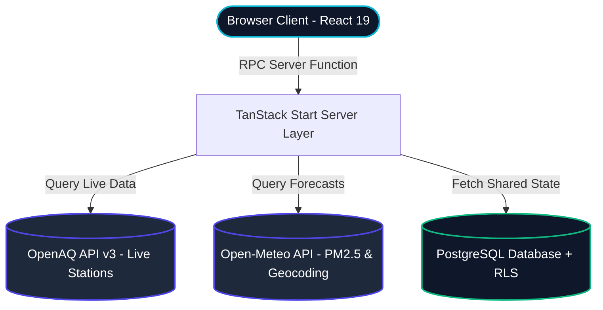

<p align="center">
  
</p>

<div align="center">
  <p>
    <a href="https://aspiranova.lovable.app/"></a>
    &nbsp;&nbsp;
    <a href="#-getting-started-locally"></a>
  </p>

  <p align="center" style="margin-top: 15px;">
    
    &nbsp;
    
    &nbsp;
    
    &nbsp;
    
    &nbsp;
    
  </p>

  <p align="center" style="max-width: 745px; margin: 25px auto 0 auto; line-height: 1.6; color: #444; font-size: 0.98rem;">
    🚀 <b>Project At-A-Glance:</b> Standard air-quality portals tell you a number. <b>Aspira Nova</b> tells you the next action. By converting 5-day particulate forecasts from OpenAQ and Open-Meteo into actionable <b>Readiness Scores</b>, Aspira alerts clinics, pharmacies, and patients to staff up, restock, or protect their health 3 days before pollution peaks.
  </p>
</div>

<hr style="border: 0; border-top: 1px solid #eee; margin: 30px 0;" />


---

## 💡 The Core Problem

Standard air-quality applications display the current AQI or PM2.5 level. But for an asthmatic patient, a clinical staff member, or a pharmacist, **a number is not a decision**. Knowing that PM2.5 is "150 µg/m³" doesn't answer:
- Should my clinic schedule more shift staff tomorrow?
- Do we have enough rescue inhalers in stock for the weekend spike?
- Is it safe for me to go for a run in my specific neighborhood, even if the nearest official station is 20 miles away?

### 🛡️ The Aspira Solution

**Aspira** shifts the paradigm from *reactive reporting* to **predictive readiness**. By translating 5-day particulate forecasts into a single, explainable **Readiness Score** based on correlation studies, Aspira generates decision-shaped guidance across clinic workloads, patient thresholds, and community action plans.

---

## 🚀 Key Modules & Product Features

| Module | Purpose | Actionable Outcome |
| :--- | :--- | :--- |
| **📈 Readiness Dial** | Translates 5-day PM2.5 forecasts into an animated, intuitive Arc Dial. | Tells you the peak respiratory strain day at a glance. |
| **🔍 Smart Region Search** | Integration with **OpenAQ v3** to search and pin global cities dynamically. | Live real-time regional statistics with no API-key setup required. |
| **⚠️ Coverage Awareness** | Analyzes nearby monitoring density. If under 2 official sensors, it flags low-confidence areas. | Automatically alerts users and shifts weight to crowd-sourced symptom reports. |
| **🏥 Clinic Outlook** | Pre-models hospital/clinic intake demand and local inhaler inventory alerts. | Advises clinics to staff up or restock rescue medications 3 days early. |
| **⚡ Personal Alerts** | Threshold-based notifications using plain-language guidance rather than raw metrics. | "Limit outdoor exposure", "Ensure inhaler is refilled by Wednesday". |
| **🗺️ Community Map** | Heatmap visualizer displaying official sensors alongside user crowdsourced symptom check-ins. | Bridges data gaps in rural or under-monitored residential neighborhoods. |

---

## 🛠️ Tech Stack & Architecture

### System Data Flow



### Stack Highlight
* **Framework:** **TanStack Start v1** (React 19) — Provides unified server functions (`createServerFn`) and file-based routing. Allows secure table operations without client exposure.
* **Styling:** **Tailwind CSS v4** — Built completely around modern semantic `oklch` design tokens for seamless light/dark rendering with zero layout thrashing.
* **Database & Auth:** **Postgres + RLS (Row Level Security)** — Keeps region configurations synced across pages safely.
* **Charts:** **Recharts** — Tailored client-side rendering for immediate interactive performance.
* **APIs:** Free-tier global coverage through **OpenAQ** and **Open-Meteo**.

---

## 📂 Pristine Repository Structure

To support clean maintenance and decoupled development, all core project files and source codes are segregated under the `aspira/` subdirectory. Only the primary entry details and documentation are kept in the root folder.

```text
.
├── aspira/                  # Complete UI & Backend Codebase
│   ├── src/                 # Client Application Pages, Components & Hooks
│   │   ├── routes/          # TanStack Start File-based Routing
│   │   ├── components/      # Dials, charts, maps, and UI layout primitives
│   │   ├── lib/             # API helpers, server RPCs, data-fetching models
│   │   └── styles.css       # Core design tokens
│   ├── public/              # Production static templates & media
│   ├── supabase/            # Database migrations & schemas
│   ├── package.json         # Project manifests and scripts
│   ├── tsconfig.json        # Strict compilation setups
│   └── vite.config.ts       # Optimized bundler configuration
└── README.md                # Premium Project Overview & Presentation (Root)
```

---

## 💻 Getting Started Locally

All project utilities are located in the `aspira/` folder. Follow these simple commands to run the development server locally:

```bash
# 1. Navigate to the project directory
cd aspira

# 2. Install dependencies
npm install

# 3. Start the dev server
npm run dev
```

The application will launch on [http://localhost:8080](http://localhost:8080).

---

## ✨ Future Enhancements & Clinic Validation
- [ ] **Clinical Model Calibration:** Integrating historical respiratory hospital admissions to refine the predictive Readiness Score weights.
- [ ] **Proactive SMS & Push Notifications:** Automatically alerting high-risk subscribers of looming PM2.5 spikes.
- [ ] **Decentralized Reputation Weighting:** Implementing sybil-resistant voting weights for community symptom reports.

<!-- Premium Visual Footer -->
<br />
<hr style="border: 0; border-top: 1px solid #eee; margin: 30px 0;" />

<div align="center">
  <table style="border: 0; border-collapse: collapse; background: none; margin: 0 auto;">
    <tr style="border: 0; background: none;">
      <td align="center" style="border: 0; padding: 10px;">
        <span style="font-size: 2.2rem;">🕊️</span>
        <h3 style="font-size: 1.4rem; margin-top: 10px; margin-bottom: 5px;">Breathe Ahead of the Forecast</h3>
        <p style="color: #666; font-size: 0.95rem; max-width: 550px; margin: 0 auto; line-height: 1.6;">
          <i>"Crafted in Bengaluru, Karnataka — bridging tech innovation with environmental purpose to secure clean air for every community, one forecast at a time."</i>
        </p>
        <div style="margin-top: 20px;">
          <a href="https://github.com/Yashaswini-V21/aspiranova"></a>
          &nbsp;&nbsp;
          <a href="https://aspiranova.lovable.app/"></a>
        </div>
        <p style="font-size: 0.8rem; color: #aaa; margin-top: 20px; font-family: monospace;">
          MIT Licensed © 2026 Aspira Nova · Free and Open-Source Project
        </p>
      </td>
    </tr>
  </table>
  
  <br />
  
  
</div>


